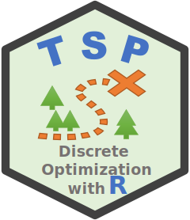
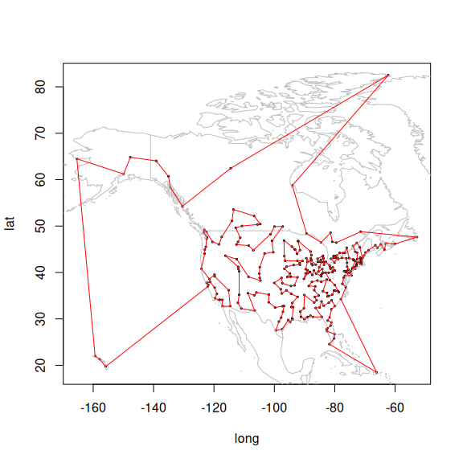

#  R package TSP - Infrastructure for the Traveling Salesperson Problem

[](https://CRAN.R-project.org/package=TSP)
[](https://CRAN.R-project.org/package=TSP)
 [](https://mhahsler.r-universe.dev/TSP)
[](https://anaconda.org/conda-forge/r-tsp)

## Introduction

The TSP package (Hahsler and Hornik 2007) provides the basic
infrastructure and some algorithms for the traveling salesman problems
(symmetric, asymmetric and Euclidean TSPs). The package provides some
fast implementations of simple algorithms including:

- Tour construction heuristics
  - **insertion algorithms**: nearest insertion, farthest insertion,
    cheapest insertion, arbitrary insertion (Rosenkrantz, Stearns, and
    Philip M. Lewis 1977)
  - **nearest neighbor methods**: Nearest neighbor and repetitive
    nearest neighbor (Rosenkrantz, Stearns, and Philip M. Lewis 1977)
- Improvement methods
  - **two-opt heuristic** (Croes 1958)
  - **simulated annealing** (Kirkpatrick, Gelatt, and Vecchi 1983)
- State-of-the-art solver
  - An interface to the **Concorde TSP solver** (Applegate et al.
    2000, 2006) and its implementation of the **Chained-Lin-Kernighan
    heuristic** (Applegate, Cook, and Rohe 2003) is provided (needs to
    be installed separately).

The package can read and write the TSPLIB format (Reinelt 1991) and it
can solve many of the problems in the [TSPLIB95 problem library (local
copy of the
archive)](https://github.com/mhahsler/TSP/tree/master/TSPLIB95).

The following R packages use `TSP`:
[archetypes](https://CRAN.R-project.org/package=archetypes),
[cholera](https://CRAN.R-project.org/package=cholera),
[condvis](https://CRAN.R-project.org/package=condvis),
[CRTspat](https://CRAN.R-project.org/package=CRTspat),
[ForagingOrg](https://CRAN.R-project.org/package=ForagingOrg),
[ggEDA](https://CRAN.R-project.org/package=ggEDA),
[isocir](https://CRAN.R-project.org/package=isocir),
[jocre](https://CRAN.R-project.org/package=jocre),
[MLCOPULA](https://CRAN.R-project.org/package=MLCOPULA),
[nilde](https://CRAN.R-project.org/package=nilde),
[nlnet](https://CRAN.R-project.org/package=nlnet),
[PairViz](https://CRAN.R-project.org/package=PairViz),
[pencopulaCond](https://CRAN.R-project.org/package=pencopulaCond),
[SCORPIUS](https://CRAN.R-project.org/package=SCORPIUS),
[sensitivity](https://CRAN.R-project.org/package=sensitivity),
[seriation](https://CRAN.R-project.org/package=seriation),
[sfnetworks](https://CRAN.R-project.org/package=sfnetworks),
[tspmeta](https://CRAN.R-project.org/package=tspmeta),
[VineCopula](https://CRAN.R-project.org/package=VineCopula)

To cite package ‘TSP’ in publications use:

> Hahsler M, Hornik K (2007). “TSP - Infrastructure for the traveling
> salesperson problem.” *Journal of Statistical Software*, *23*(2),
> 1-21. ISSN 1548-7660, <doi:10.18637/jss.v023.i02>
> <https://doi.org/10.18637/jss.v023.i02>.

    @Article{,
      title = {TSP -- {I}nfrastructure for the traveling salesperson problem},
      author = {Michael Hahsler and Kurt Hornik},
      year = {2007},
      journal = {Journal of Statistical Software},
      volume = {23},
      number = {2},
      pages = {1--21},
      doi = {10.18637/jss.v023.i02},
      month = {December},
      issn = {1548-7660},
    }

## Installation

**Stable CRAN version:** Install from within R with

``` r
install.packages("TSP")
```

**Current development version:** Install from
[r-universe.](https://mhahsler.r-universe.dev/TSP)

``` r
install.packages("TSP",
    repos = c("https://mhahsler.r-universe.dev",
              "https://cloud.r-project.org/"))
```

## Usage

Load a data set with 312 cities (USA and Canada) and create a TSP
object.

``` r
library("TSP")
data("USCA312")

tsp <- TSP(USCA312)
tsp
```

    ## object of class 'TSP' 
    ## 312 cities (distance 'euclidean')

Find a tour using the default heuristic.

``` r
tour <- solve_TSP(tsp)
tour
```

    ## object of class 'TOUR' 
    ## result of method 'arbitrary_insertion+two_opt' for 312 cities
    ## tour length: 41941

Show the first few cities in the tour.

``` r
head(tour, n = 10)
```

    ## Winston-Salem, NC     Charlotte, NC     Asheville, NC    Greenville, SC 
    ##               306                54                10               110 
    ##   Spartanburg, NC       Augusta, GA      Columbia, SC    Charleston, SC 
    ##               260                14                64                52 
    ##      Savannah, GA  Jacksonville, FL 
    ##               250               127

Visualize the complete tour.

``` r
library(maps)
data("USCA312_GPS")

plot((USCA312_GPS[, c("long", "lat")]), cex = 0.3)
map("world", col = "gray", add = TRUE)
polygon(USCA312_GPS[, c("long", "lat")][tour, ], border = "red")
```

<!-- -->

An online example application of TSP can be found on
[shinyapps](https://shrinidhee.shinyapps.io/SimpleTSP).

## Help and Bug Reports

You can find Q&A’s and ask your own questions at
<https://stackoverflow.com/search?q=TSP+R>

Please submit bug reports to <https://github.com/mhahsler/TSP/issues>

## References

<div id="refs" class="references csl-bib-body hanging-indent"
entry-spacing="0">

<div id="ref-Applegate2000" class="csl-entry">

Applegate, David, Robert E. Bixby, Vasek Chvátal, and William Cook.
2000. “TSP Cuts Which Do Not Conform to the Template Paradigm.” In
*Computational Combinatorial Optimization, Optimal or Provably
Near-Optimal Solutions*, edited by M. Junger and D. Naddef,
2241:261–304. Lecture Notes in Computer Science. London, UK:
Springer-Verlag. <https://doi.org/10.1007/3-540-45586-8_7>.

</div>

<div id="ref-Applegate2006" class="csl-entry">

Applegate, David, Robert Bixby, Vasek Chvátal, and William Cook. 2006.
*Concorde TSP Solver*.
<https://www.math.uwaterloo.ca/tsp/concorde.html>.

</div>

<div id="ref-Applegate2003" class="csl-entry">

Applegate, David, William Cook, and Andre Rohe. 2003. “Chained
Lin-Kernighan for Large Traveling Salesman Problems.” *INFORMS Journal
on Computing* 15 (1): 82–92.
<https://doi.org/10.1287/ijoc.15.1.82.15157>.

</div>

<div id="ref-Croes1958" class="csl-entry">

Croes, G. A. 1958. “A Method for Solving Traveling-Salesman Problems.”
*Operations Research* 6 (6): 791–812.
<https://doi.org/10.1287/opre.6.6.791>.

</div>

<div id="ref-TSP:Hahsler+Hornik2007" class="csl-entry">

Hahsler, Michael, and Kurt Hornik. 2007. “TSP – Infrastructure for the
Traveling Salesperson Problem.” *Journal of Statistical Software* 23
(2): 1–21. <https://doi.org/10.18637/jss.v023.i02>.

</div>

<div id="ref-Kirkpatrick1983" class="csl-entry">

Kirkpatrick, S., C. D. Gelatt, and M. P. Vecchi. 1983. “Optimization by
Simulated Annealing.” *Science* 220 (4598): 671–80.
<https://doi.org/10.1126/science.220.4598.671>.

</div>

<div id="ref-Reinelt1991" class="csl-entry">

Reinelt, Gerhard. 1991. “TSPLIB—a Traveling Salesman Problem Library.”
*ORSA Journal on Computing* 3 (4): 376–84.
<https://doi.org/10.1287/ijoc.3.4.376>.

</div>

<div id="ref-Rosenkrantz1977" class="csl-entry">

Rosenkrantz, Daniel J., Richard E. Stearns, and II Philip M. Lewis.
1977. “An Analysis of Several Heuristics for the Traveling Salesman
Problem.” *SIAM Journal on Computing* 6 (3): 563–81.
<https://doi.org/10.1007/978-1-4020-9688-4_3>.

</div>

</div>
