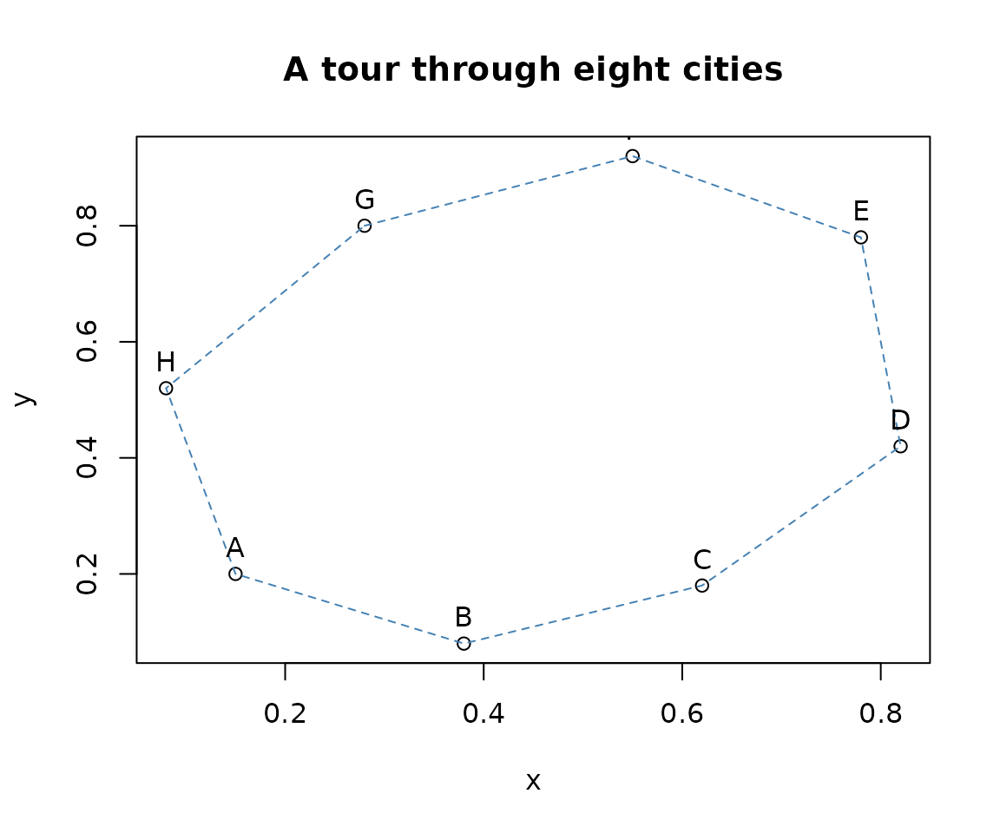

# Getting started with TSP

The traveling salesperson problem asks for the shortest round trip that
visits each city exactly once. The **TSP** package provides classes for
representing traveling salesperson problems, several construction and
improvement heuristics, and interfaces to the external Concorde solver.

This vignette covers the typical workflow:

1.  Create a problem from coordinates or a distance matrix.
2.  Find a tour with
    [`solve_TSP()`](http://michael.hahsler.net/TSP/reference/solve_TSP.md).
3.  Inspect, compare, and visualize solutions.

## Installation

Install the released version from CRAN:

``` r

install.packages("TSP")
```

Then load the package:

``` r

library(TSP)
```

## Create a problem from coordinates

For locations described by coordinates, create a Euclidean traveling
salesperson problem with
[`ETSP()`](http://michael.hahsler.net/TSP/reference/ETSP.md). Row names
are used as city labels.

``` r

cities <- data.frame(
  x = c(0.15, 0.38, 0.62, 0.82, 0.78, 0.55, 0.28, 0.08),
  y = c(0.20, 0.08, 0.18, 0.42, 0.78, 0.92, 0.80, 0.52),
  row.names = LETTERS[1:8]
)

problem <- ETSP(cities)
problem
#> object of class 'ETSP' 
#> 8 cities (Euclidean TSP)
n_of_cities(problem)
#> [1] 8
labels(problem)
#> [1] "A" "B" "C" "D" "E" "F" "G" "H"
```

An `ETSP` stores the coordinates directly. Most built-in heuristics
convert it to a distance-based `TSP` internally. For very large
coordinate sets this distance matrix can require substantial memory.

## Solve the problem

[`solve_TSP()`](http://michael.hahsler.net/TSP/reference/solve_TSP.md)
returns a `TOUR`, an integer permutation giving the order in which the
cities are visited. The default combines arbitrary insertion with 2-opt
improvement.

``` r

tour <- solve_TSP(problem, seed = 123)
tour
#> object of class 'TOUR' 
#> result of method 'arbitrary_insertion+two_opt' for 8 cities
#> tour length: 2.430432
as.integer(tour)
#> [1] 7 6 5 4 3 2 1 8
labels(tour)
#> [1] "G" "F" "E" "D" "C" "B" "A" "H"
tour_length(tour)
#> [1] 2.430432
```

The stored tour length includes the final edge from the last city back
to the first. A TSP solution is therefore a cycle, not an open path.

Plot the coordinates and the resulting tour with
[`plot()`](https://rdrr.io/r/graphics/plot.default.html):

``` r

plot(problem, tour, main = "A tour through eight cities", tour_col = "steelblue")
```



## Create a problem from distances

If pairwise distances or costs are already available, pass a `dist`
object or a symmetric matrix to
[`TSP()`](http://michael.hahsler.net/TSP/reference/TSP.md).

``` r

distance_problem <- TSP(dist(cities))
distance_problem
#> object of class 'TSP' 
#> 8 cities (distance 'euclidean')

distance_tour <- solve_TSP(distance_problem, method = "nn", start = 1)
distance_tour
#> object of class 'TOUR' 
#> result of method 'nn' for 8 cities
#> tour length: 2.430432
tour_length(distance_tour)
#> [1] 2.430432
```

[`TSP()`](http://michael.hahsler.net/TSP/reference/TSP.md) does not
require distances to be Euclidean; they can represent any symmetric
dissimilarity or cost. Missing connections can be represented by `Inf`,
while `NA` values are not allowed.

## Choose and compare heuristics

Construction heuristics build a tour from scratch. Common choices
include nearest neighbor (`"nn"`) and nearest, cheapest, farthest, or
arbitrary insertion. Improvement heuristics such as `"two_opt"` start
from an existing tour and try to shorten it.

``` r

methods <- c(
  "nearest neighbor" = "nn",
  "nearest insertion" = "nearest_insertion",
  "cheapest insertion" = "cheapest_insertion",
  "repetitive nearest neighbor" = "repetitive_nn"
)

tours <- lapply(methods, function(method) {
  solve_TSP(problem, method = method, seed = 123)
})

sort(vapply(tours, tour_length, numeric(1)))
#> repetitive nearest neighbor            nearest neighbor 
#>                    2.430432                    2.430432 
#>           nearest insertion          cheapest insertion 
#>                    2.430432                    2.430432
```

Add `two_opt = TRUE` to refine a constructed tour, or explicitly improve
an existing tour:

``` r

initial_tour <- solve_TSP(problem, method = "nn", start = 1)
improved_tour <- solve_TSP(
  problem,
  method = "two_opt",
  tour = initial_tour
)

c(
  initial = tour_length(initial_tour),
  improved = tour_length(improved_tour)
)
#>  initial improved 
#> 2.430432 2.430432
```

Randomized methods support `seed` for reproducibility and `rep` for
repeated starts. For example, the following returns the shortest of 20
random tours, each followed by 2-opt improvement:

``` r

repeated_tour <- solve_TSP(
  problem,
  method = "random",
  rep = 20,
  two_opt = TRUE,
  seed = 123
)
tour_length(repeated_tour)
#> [1] 2.430432
```

These methods are heuristics: a short tour is not necessarily an optimal
tour. The `"concorde"` method can find an exact solution, and
`"linkern"` provides the Chained Lin-Kernighan heuristic, but both
require a separately installed Concorde executable. See
[`?Concorde`](http://michael.hahsler.net/TSP/reference/Concorde.md) for
setup instructions.

## Asymmetric problems

When the cost from city *i* to city *j* differs from the reverse
direction, create an asymmetric problem with
[`ATSP()`](http://michael.hahsler.net/TSP/reference/ATSP.md) from a
square cost matrix.

``` r

cost <- matrix(
  c(
    0, 4, 1, 3,
    2, 0, 5, 1,
    3, 2, 0, 4,
    6, 3, 2, 0
  ),
  nrow = 4,
  byrow = TRUE,
  dimnames = list(LETTERS[1:4], LETTERS[1:4])
)

asymmetric_problem <- ATSP(cost)
asymmetric_tour <- solve_TSP(asymmetric_problem, method = "nn", start = 1)
asymmetric_tour
#> object of class 'TOUR' 
#> result of method 'nn' for 4 cities
#> tour length: 10
tour_length(asymmetric_tour)
#> [1] 10
```

Most built-in heuristics work directly with both `TSP` and `ATSP`
objects. Solvers that only accept symmetric problems can use the
package’s automatic ATSP-to-TSP reformulation; see
[`?reformulate_ATSP_as_TSP`](http://michael.hahsler.net/TSP/reference/reformulate_ATSP_as_TSP.md).

## Where to go next

The most useful help pages are:

- [`?solve_TSP`](http://michael.hahsler.net/TSP/reference/solve_TSP.md)
  for all solvers and their control parameters;
- [`?TSP`](http://michael.hahsler.net/TSP/reference/TSP.md),
  [`?ETSP`](http://michael.hahsler.net/TSP/reference/ETSP.md), and
  [`?ATSP`](http://michael.hahsler.net/TSP/reference/ATSP.md) for
  problem representations;
- [`?TOUR`](http://michael.hahsler.net/TSP/reference/TOUR.md) and
  [`?tour_length`](http://michael.hahsler.net/TSP/reference/tour_length.md)
  for working with solutions;
- [`?read_TSPLIB`](http://michael.hahsler.net/TSP/reference/TSPLIB.md)
  and
  [`?write_TSPLIB`](http://michael.hahsler.net/TSP/reference/TSPLIB.md)
  for TSPLIB files; and
- [`?insert_dummy`](http://michael.hahsler.net/TSP/reference/insert_dummy.md)
  and
  [`?cut_tour`](http://michael.hahsler.net/TSP/reference/cut_tour.md)
  for turning a cycle into one or more paths.
